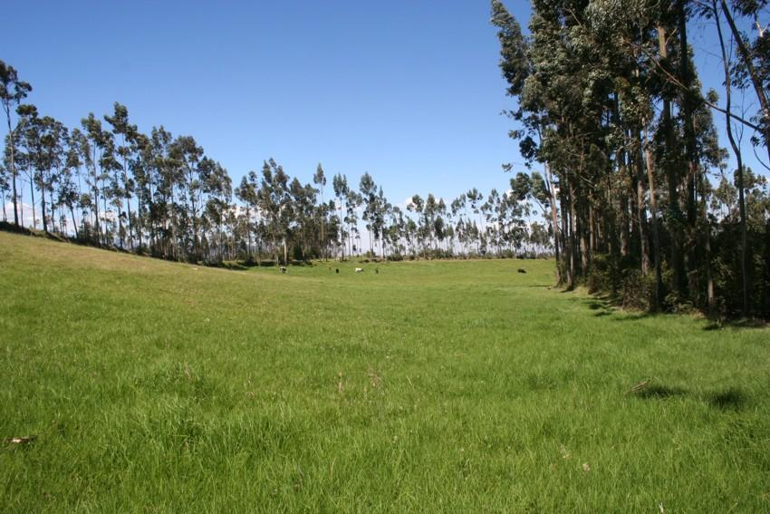

# Dataset: Terrenos Quito
* **Autor:** Fausto De La Torre
* **Fecha:** 22 de octubre de 2020

## Contexto
Con el afán de tomar decisiones más acertadas en relación a la inversión en bienes raíces, he decidido recolectar información acerca de los terrenos disponibles a la venta en la ciudad de Quito, Ecuador y sus alrededores. 
Uno de los sitios web con más prestigio dentro de Ecuador para la publicación de compra y venta de bienes inmuebles es **plusvalia.com**. Cuenta con un sinnúmero de información acerca de propiedades en su base de datos, sin embargo no existe una api pública con la cuál obtener la información deseada. La información que ese puede enontrar en esta página esta relacionada al precio de venta, tamaño, sector, etc. de dichos bienes, lo cuál me servirá para analizar áreas con máyor pluvalía que otras así como el precio por metro cuadrado para saber en donde puedo invertir. 

## Título del data set
Me enfocaré únicamente en los terrenos en la ciudad de Quito, no en edificaciones. por lo que el nombre sera:
TerrenosQuito

## Descrpción del Contenido
El contenido del set de datos generados contiene un listado de anuncios de terrenos en venta en la ciudad de Quito, Ecuador. Fue obtenido el 22 de octubre de 2019 y contiene 5.453 registros obtenidos de 219 páginas en el sitio web.

## Representación Gráfica

    
    
Figura 1: Terreno en venta (Pintag, Los Chillos, Quito, 2020)

## Contenido
El contenido del set de datos generados contiene un listado de anuncios de terrenos en venta con los siguientes campos:
* **nombre** Nombre del terreno en venta
* **sector** Sector donde se encuentra el terreno, el valor será Sector, Ciudad (todos los registros corresponden a Quito)
* **precio** Valor en dólares, el valor incluye la moneda (USD 24.500)
* **area** Área del terreno con su unidad y descripción (500 m2 totales)
* **publicador1** Empresa que publica el anuncio de venta. El valor es obtenido de la imagen del logo (/mutualistaPichincha.jpg)
* **publicador2** Segunda empresa (si existe) que publica el anuncio de venta. El valor es obtenido de la imagen del logo
* **tiempo_publicacion** Hace cuánto fue publicado el anuncio de venta
* **finalizado** Indica si el bien está finalizado o en planos, si el valor está vacío es que ya está finalizado
* **fecha_venta** Indica cuando el bien esta disponible para la venta, si el valor está vacío quiere decir que está disponible

## Agradecimientos
Los datos se obtuvieron del sitio web [plusvalia.com](https://www.plusvalia.com). He ocupado python con técnicas de *Web Scraping* para obtener la información mostrada en 219 páginas. He filtrado la información previamente para solo obtener unformación de terrenos, para ello he realizado la extracción de la url que contiene los filtros y la páginación https://www.plusvalia.com/terrenos-en-venta-en-quito-pagina-10.html.

## Inspiración
Este conjunto de datos es interesante ya que incluye la información acerca del valor y el tamaño de un terreno en venta. Esta información puede ser utilizada para determinar de una mejor manera inversiones en biens raíces. Mi hipótesis es que puedo obtener items que destaquen sobre el resto debido a su potencialidad de adquirir más valor en el tiempo, debido a su bajo costo por metro cuadrado y a su ubicación privilegiada.

## Licencia
Este conjunto de datos se encuentra bajo la licencia [**Attribution-ShareAlike 4.0 International (CC BY-SA 4.0)**] (https://creativecommons.org/licenses/by-sa/4.0/) con el propósito de que sea usado y adaptado libremente. He seleccionado esta licencia porque:
* Se puede copiar o distribuir la información en cualquier formato
* Se puede transformar y hacer lo que plazca, incluso se la puede usar comercialmente
* Con el propósito de que la información sea distribuida libremente esta licencia obliga a las personas que cambian la información distribuirla con la misma licencia. 

## Código fuente
El código fuente se encuentra alojado en github en el repositorio [web-scraping-plusvalia](https://github.com/faustodelatog/web-scraping-plusvalia)

## Conjunto de datos
El conjunto de datos se encuentra en el directorio *output* del repositorio. En este [enlace](https://github.com/faustodelatog/web-scraping-plusvalia/output/terrenos_quito.csv) 
